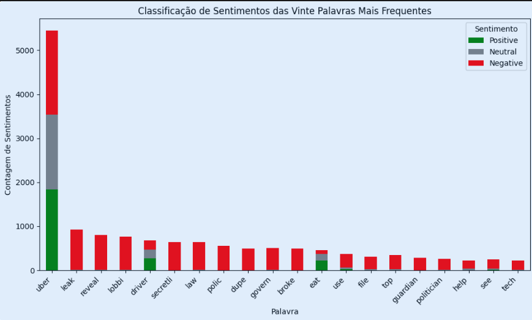

# Análise de Feedback Positivo sobre a Uber no Twitter usando Visualização de Dados

Nesta atividade, vamos explorar o uso de gráficos de visualização para analisar a distribuição de feedbacks positivos sobre a Uber no Twitter ao longo do tempo. O nosso objetivo é entender melhor como as palavras positivas mais citadas associadas à Uber evoluem, fornecendo insights para aprimorar os serviços e estratégias de marketing da empresa. A escolha e a análise desses gráficos nos permitirão monitorar continuamente os aspectos mais valorizados pelos usuários e ajustar nossas ações em conformidade.

O gráfico principal que utilizaremos é o das "Top 20 Palavras Positivas Associadas à Uber ao Longo do Tempo". Este gráfico nos ajuda a visualizar quais termos positivos estão sendo mais frequentemente mencionados em relação à Uber, como "segurança", "confiabilidade" e "satisfação". Essas informações são importantes para identificar tendências positivas e ajustar as estratégias de marketing e desenvolvimento de produtos, garantindo que os pontos fortes da empresa sejam continuamente reforçados. A análise desses dados permite que a Uber foque em áreas específicas que são bem vistas pelo público, aumentando a satisfação do cliente e fortalecendo a imagem da marca.

Além disso, utilizaremos um "Gráfico de Alerta no Slack com Crescimento Percentual de Palavras", para o monitoramento em tempo real das mudanças no sentimento dos usuários. Este sistema de alertas permite que a equipe da Uber identifique rapidamente qualquer aumento significativo nas menções de palavras positivas ou negativas, possibilitando uma resposta proativa. Por exemplo, se uma palavra negativa como "insegurança" começar a aparecer com mais frequência, a equipe pode agir imediatamente para resolver o problema antes que ele se torne uma crise maior. Da mesma forma, o crescimento de palavras positivas pode ser reforçado nas comunicações e serviços, melhorando a experiência do cliente e a reputação da empresa.

Para a construção desses gráficos, utilizamos como referência o site [Visualizing Distributions: Histograms and Density Plots](https://clauswilke.com/dataviz/histograms-density-plots.html). Este recurso nos forneceu uma compreensão sobre as melhores práticas na visualização de distribuições de dados, especialmente no contexto de histogramas e gráficos de densidade. Abaixo, a figura representa um exemplo de gráfico das 20 palavras mais citadas pelos twittes, feita pelo próprio grupo *Thunder.*

<div align="center">
<sub>Figura 1 - Gráfico das 20 Palavras Mais Citadas</sub>

<sup>Fonte: Material produzido pelos autores (2024)</sup>
</div>

Este gráfico é uma representação visual para entendermos a percepção dos usuários em relação à Uber, permitindo-nos identificar e reforçar os aspectos mais valorizados pelos clientes.

## Gráficos Escolhidos

### Relação dos Gráficos e Estratégias

1. **Gráfico de top 20 palavras citadas como positivas que mais aparecem no twitter associadas à Uber ao longo do tempo:**
    1. As estratégias pensadas para esse gráfico são:
        1. Monitoramento contínuo de feedbacks positivos: O objetivo é identificar as palavras e temas positivos que estão sendo mais frequentemente associados à Uber ao longo do tempo.
        2. Aprimoramento e Valorização dos Serviços: Compreender quais aspectos do serviço são mais apreciados permite que a Uber possa focar em manter e melhorar essas áreas, garantindo que os pontos fortes da empresa sejam continuamente reforçados.
        3. Campanhas de Marketing Direcionadas: Utilizar as informações sobre as palavras positivas mais citadas para criar campanhas de marketing que enfatizem esses aspectos valorizados pelos usuários, aumentando a eficácia das campanhas publicitárias e melhorando a imagem da marca.
2. **Alerta no slack dado ao crescimento percentual de uma palavra que está no top 20.**
    1. As estratégias pensadas para esse gráfico são:
        1. Monitoramento em Tempo Real: Implementar um sistema que monitore o crescimento percentual de palavras positivas e negativas dentro do top 20, permitindo uma vigilância constante sobre as mudanças na percepção dos usuários.
        2. Resposta Proativa a Problemas e Oportunidades: Quando uma palavra positiva ou negativa mostra um crescimento significativo, um alerta é enviado para a equipe no Slack. Isso permite uma resposta rápida, seja para mitigar um problema emergente ou para capitalizar em um aspecto positivo crescente.
        3. Prevenção de Crises: Detectar rapidamente o crescimento de palavras negativas permite que a equipe da Uber tome medidas preventivas para resolver problemas antes que se tornem crises maiores, protegendo a reputação da empresa.
        4. Reforço de Aspectos Positivos: Identificar palavras positivas em crescimento também oferece a oportunidade de reforçar esses pontos nas comunicações e serviços da Uber, melhorando a experiência do cliente e fortalecendo a marca.

Umas coisa interessante, é que os gráficos seriam a extensão um do outro, ou seja: o usuário teria uma visão geral a partir do gráfico “Top 20 palavras citadas como positivas que mais aparecem no twitter”, que seja um gráfico de densidade, e caso queira entender mais profundamente o impacto de uma palavra específica, ele poderia analisar o “Crescimento percentual de uma palavra que está no top 20”.

### Justificativa das Escolhas:

**1. Gráfico das Top 20 Palavras Positivas Associadas à Uber ao Longo do Tempo**

*- Motivação:* Esse gráfico permite visualizar quais palavras positivas estão mais frequentemente associadas à Uber em discussões online ao longo do tempo. A análise dessas palavras pode ajudar a identificar tendências positivas e aspectos valorizados pelos usuários, como "segurança", "confiabilidade", ou "satisfação". Além disso, pode auxiliar a equipe de marketing e atendimento ao cliente a focar em áreas que são bem vistas pelo público, reforçando essas qualidades nas campanhas publicitárias e melhorias no serviço.

**2. Gráfico de Alerta no Slack com Crescimento Percentual de Palavras**

*- Motivação:* Implementar um sistema de alerta no Slack baseado no crescimento percentual das palavras no top 20 permite à equipe da Uber identificar rapidamente mudanças significativas nas conversas online. Se uma palavra relacionada a um aspecto positivo ou negativo da Uber começar a crescer rapidamente, a equipe pode agir de forma proativa. Por exemplo, se a palavra "insegurança" aparece com mais frequência, pode indicar um problema emergente que precisa ser abordado imediatamente.

### **Explicação Detalhada da Escolha**

**Gráfico das Top 20 Palavras Positivas:**

- *Visualização das Tendências:* O gráfico ajuda a entender quais aspectos positivos são mais valorizados pelos usuários ao longo do tempo, fornecendo insights para a estratégia de marketing e desenvolvimento de produtos.
- *Análise de Sentimentos:* Ao focar nas palavras positivas, a Uber pode continuar aprimorando os aspectos mais apreciados pelos usuários, aumentando a satisfação e fidelidade.

**Gráfico de Alerta no Slack:**

- *Monitoramento em Tempo Real:* Permite à equipe da Uber responder rapidamente a mudanças no sentimento dos usuários, prevenindo crises e melhorando a comunicação com os clientes.
- *Ação Proativa:* Com alertas em tempo real, a Uber pode tomar medidas melhorando a experiência do usuário e a reputação da empresa. A combinação desses gráficos pode ser utilizada em casos assertivos de marketing em relação à feedbacks positivos, permitindo uma abordagem estratégica e proativa na gestão da marca e do serviço.

## Parte técnica

### Exemplos de Alerta e Não-Alerta

**Exemplos de Alerta:**

Mensagem 125: "Thank you to my Uber driver for not speaking a single word to me the entire 20 minute drive back to my house" - Indica uma experiência de usuário positiva e satisfatória.

Mensagem 22: "bro i IMMEDIATELY opener uber eats" - Reflete uma ação positiva e rápida do usuário.

Mensagem 193: "thinking about my uber driver from last night who was talking about how in love he is with his wife" - Reflete uma interação positiva e uma experiência agradável com o motorista.

**Exemplos de Não-Alerta:**

Mensagem 5: "i had a bad drive . i want my refund" - Reflete um problema de serviço que pode exigir ação imediata.

Mensagem 25: "Uber broke laws, duped police and secretly lobbied governments, leak reveals" - Reflete um problema sério que pode ter impacto na reputação e exigir uma resposta imediata.

Mensagem 65: "So be careful with app. It overcharged my credit card and even though store confirmed it was overcharged, Uber support is terrible" - Indica um problema de cobrança que precisa ser investigado.

### Testes

**Teste 1: Validação de Experiências Positivas**

Pré-condição:

Acesso à base de dados com registros de feedback dos usuários.

Procedimento de Teste:

- Filtrar todas as mensagens que contêm feedback positivo dos usuários.
- Verificar se há um reconhecimento ou agradecimento por parte da empresa para cada mensagem positiva.
- Avaliar se a empresa está incentivando continuamente o feedback positivo dos usuários.

Pós-condição:

Confirmar que todas as mensagens positivas receberam reconhecimento e que a empresa está promovendo um ambiente que incentiva feedback positivo.

**Teste 2: Monitoramento de Problemas de Serviço e Cobrança**

Pré-condição:

Acesso à base de dados de transações e mensagens de suporte.

Procedimento de Teste:

- Filtrar todas as mensagens que mencionam problemas de serviço ou cobrança.
- Verificar as transações associadas aos usuários que relataram problemas.
- Verificar as respostas da equipe de suporte e se os reembolsos ou ajustes foram realizados corretamente.

Pós-condição:

Confirmar que todos os problemas de serviço e cobrança relatados foram investigados e corrigidos, e que os usuários recebem notificações apropriadas sobre a resolução.

### Abordagem técnica para implementação do alerta

Para implementar a abordagem técnica para o alerta, considera-se as seguintes etapas: pré-processamento, análise de similaridade, e técnicas de vetorização (BoW e Word2Vec). Abaixo, apresento a abordagem detalhada e um exemplo prático para cada etapa.

**1. Pré-processamento**

O pré-processamento é fundamental para garantir que os dados textuais estejam limpos e prontos para a análise. As etapas principais incluem:

1. **Remoção de Stop Words**: Elimina palavras comuns que não agregam valor significativo ao contexto.
2. **Tokenização**: Divide o texto em unidades menores chamadas tokens.
3. **Lematização**: Reduz as palavras às suas formas base, preservando o significado.

Exemplo:

```python
import nltk
from nltk.corpus import stopwords
from nltk.tokenize import word_tokenize
from nltk.stem import WordNetLemmatizer

# Baixar os recursos necessários
nltk.download('punkt')
nltk.download('stopwords')
nltk.download('wordnet')

def preprocess_text(text):
    # Remover stop words
    stop_words = set(stopwords.words('english'))
    words = word_tokenize(text)
    filtered_words = [word for word in words if word.lower() not in stop_words]

    # Lematização
    lemmatizer = WordNetLemmatizer()
    lemmatized_words = [lemmatizer.lemmatize(word) for word in filtered_words]

    return lemmatized_words

text = "Besides elevating diversity, the idea is to make the service more friendly so that Uber can also be a source of income for them."
preprocessed_text = preprocess_text(text)
print(preprocessed_text)

```

**2. Análise de Similaridade**

Após o pré-processamento, precisamos calcular a similaridade entre textos para identificar padrões. Utilizaremos a similaridade de cosseno como exemplo.

Exemplo:

```python
from sklearn.feature_extraction.text import TfidfVectorizer
from sklearn.metrics.pairwise import cosine_similarity

# Exemplo de textos
texts = [
    "Uber elevates diversity and makes the service friendly.",
    "The service provided by Uber is a source of income.",
    "Uber focuses on making their service more diverse and friendly."
]

# Vetorização TF-IDF
vectorizer = TfidfVectorizer()
tfidf_matrix = vectorizer.fit_transform(texts)

# Similaridade de Cosseno
cosine_sim = cosine_similarity(tfidf_matrix, tfidf_matrix)
print(cosine_sim)

```

**3. Técnicas de Vetorização (BoW e Word2Vec)**

**Bag of Words (BoW)**

BoW é uma técnica que cria um vetor com base na contagem de palavras no texto.

Exemplo:

```python
from sklearn.feature_extraction.text import CountVectorizer

# Exemplo de textos
texts = [
    "Uber elevates diversity and makes the service friendly.",
    "The service provided by Uber is a source of income.",
    "Uber focuses on making their service more diverse and friendly."
]

# Vetorização BoW
vectorizer = CountVectorizer()
bow_matrix = vectorizer.fit_transform(texts)
print(bow_matrix.toarray())

```

**Word2Vec**

Word2Vec cria representações vetoriais das palavras que capturam semântica e contexto.

Exemplo:

```python
from gensim.models import Word2Vec

# Exemplo de textos tokenizados
tokenized_texts = [
    preprocess_text("Uber elevates diversity and makes the service friendly."),
    preprocess_text("The service provided by Uber is a source of income."),
    preprocess_text("Uber focuses on making their service more diverse and friendly.")
]

# Treinamento do modelo Word2Vec
model = Word2Vec(sentences=tokenized_texts, vector_size=100, window=5, min_count=1, workers=4)

# Vetor para a palavra 'Uber'
vector_uber = model.wv['Uber']
print(vector_uber)

```

### Testagem e Escolha dos Modelo

**Modelos**

Para entender o melhor modelo para ser utilizado, primeiro seria importante realizar a treinagem de diversos modelos, foi feito o Naive Bayes e Random Forest para ilustrar:

```python
import numpy as np
import pandas as pd
from sklearn.feature_extraction.text import TfidfVectorizer
from sklearn.model_selection import train_test_split
from sklearn.naive_bayes import MultinomialNB
from xgboost import XGBClassifier
from sklearn.ensemble import RandomForestClassifier
from sklearn.svm import SVC
from sklearn.metrics import accuracy_score, classification_report, confusion_matrix
def train_naive_bayes(X, y):
    """
    Train a Naive Bayes classifier.
    Args:
    X (pd.Series): Series of text data.
    y (pd.Series): Series of labels.
    Returns:
    model (MultinomialNB): Trained Naive Bayes model.
    """
    vectorizer = TfidfVectorizer()
    X_tfidf = vectorizer.fit_transform(X)
    X_train, X_test, y_train, y_test = train_test_split(X_tfidf, y, test_size=0.2, random_state=42)
    model = MultinomialNB()
    model.fit(X_train, y_train)
    y_pred = model.predict(X_test)
    print('Naive Bayes Accuracy:', accuracy_score(y_test, y_pred))
    print('Naive Bayes Report:', classification_report(y_test, y_pred))
    return model, vectorizer
def train_naive_bayes(X, y):
    """
    Treina um classificador Naive Bayes.
    Argumentos:
    X (pd.Series): Série de dados de texto.
    y (pd.Series): Série de rótulos.
    Retorna:
    model (MultinomialNB): Modelo Naive Bayes treinado.
    """
    vectorizer = TfidfVectorizer()
    X_tfidf = vectorizer.fit_transform(X)
    X_train, X_test, y_train, y_test = train_test_split(X_tfidf, y, test_size=0.2, random_state=42)
    model = MultinomialNB()
    model.fit(X_train, y_train)
    y_pred = model.predict(X_test)
    print('Naive Bayes Accuracy:', accuracy_score(y_test, y_pred))
    print('Naive Bayes Report:', classification_report(y_test, y_pred))
    return model, vectorizer
```

```python
def train_random_forest(X, y):
    """
    Treina um classificador Random Forest.
    Argumentos:
    X (pd.Series): Série de dados de texto.
    y (pd.Series): Série de rótulos.
    Retorna:
    model (RandomForestClassifier): Modelo Random Forest treinado.
    """
    vectorizer = TfidfVectorizer()
    X_tfidf = vectorizer.fit_transform(X)
    X_train, X_test, y_train, y_test = train_test_split(X_tfidf, y, test_size=0.2, random_state=42)
    model = RandomForestClassifier()
    model.fit(X_train, y_train)
    y_pred = model.predict(X_test)
    print('Random Forest Accuracy:', accuracy_score(y_test, y_pred))
    print('Random Forest Report:', classification_report(y_test, y_pred))
    return model, vectorizer
def train_svm(X, y):
    """
    Treina um classificador SVM (Support Vector Machine).
    Argumentos:
    X (pd.Series): Série de dados de texto.
    y (pd.Series): Série de rótulos.
    Retorna:
    model (SVC): Modelo SVM treinado.
    """
    vectorizer = TfidfVectorizer()
    X_tfidf = vectorizer.fit_transform(X)
    X_train, X_test, y_train, y_test = train_test_split(X_tfidf, y, test_size=0.2, random_state=42)
    model = SVC()
    model.fit(X_train, y_train)
    y_pred = model.predict(X_test)
    print('SVM Accuracy:', accuracy_score(y_test, y_pred))
    print('SVM Report:', classification_report(y_test, y_pred))
    return model, vectorizer

# Exemplo de uso com dados fictícios
# frases = pd.Series(['Eu amo programação', 'Python é incrível', 'Machine Learning é o futuro', 'Eu gosto de café'])
# labels = pd.Series([1, 1, 1, 0])
# model_nb, vec_nb = train_naive_bayes(frases, labels)
# model_xgb, vec_xgb = train_xgboost(frases, labels)
# model_rf, vec_rf = train_random_forest(frases, labels)
# model_svm, vec_svm = train_svm(frases, labels)
```

**Análise dos Modelos**

Para analisar os modelos, faremos o seguinte:

Coleta de Dados: Recolheremos um conjunto de dados de frases e suas respectivas classificações.

Pré-processamento: Usaremos o TfidfVectorizer para transformar as frases em uma matriz TF-IDF.

Divisão dos Dados: Dividiremos os dados em conjuntos de treino e teste.

Treinamento dos Modelos: Treinaremos os quatro modelos diferentes.

Avaliação dos Modelos: Avaliaremos os modelos usando métricas como accuracy_score, classification_report e confusion_matrix.Parte Analítica

Para eleger o melhor modelo, consideraremos os seguintes pontos:

- Acurácia: A acurácia é uma métrica básica, mas importante. Ela nos diz a porcentagem de classificações corretas feitas pelo modelo.

Exemplo: Se tivermos 100 frases e o modelo classificar corretamente 90, a acurácia será de 90%.

- Relatório de Classificação: Fornece métricas detalhadas como precisão, recall e F1-score para cada classe. Essas métricas ajudam a entender o desempenho do modelo em cada classe individualmente.
- Precisão: Proporção de verdadeiros positivos sobre todos os positivos preditos. Importante quando a penalidade para falsos positivos é alta.
- Recall: Proporção de verdadeiros positivos sobre todos os positivos reais. Importante quando a penalidade para falsos negativos é alta.
- F1-Score: Média harmônica de precisão e recall, útil quando precisamos de um balanço entre os dois.
- Matriz de Confusão: Mostra a quantidade de verdadeiros positivos, falsos positivos, verdadeiros negativos e falsos negativos. Ajuda a identificar se o modelo tem tendência a cometer certos tipos de erros.

Exemplo: Se um modelo classificar frases positivas como negativas muitas vezes, a matriz de confusão mostrará um número alto de falsos negativos.

Tempo de Treinamento e Predição: Avaliar o tempo que cada modelo leva para treinar e fazer predições. Modelos mais complexos como XGBoost podem ser mais precisos, mas também mais lentos.

- Robustez do Modelo: Considerar a robustez do modelo em relação a diferentes conjuntos de dados. Modelos como Naive Bayes podem ser mais robustos com dados limitados, enquanto modelos como Random Forest podem ser mais sensíveis a variações nos dados.Com essas análises, poderemos escolher o modelo que melhor se adequa ao nosso problema específico, equilibrando precisão, tempo de execução e robustez.

### Definição de Testes

**Teste 1: Validação de Solicitação de Reembolso**

Pré-condição:

Acesso à base de dados com registros de solicitações de reembolso.

Procedimento de Teste:

- Filtrar todas as mensagens que contêm solicitações de reembolso ou reclamações relacionadas a viagens ruins.
- Verificar se há uma resposta da equipe de suporte para cada mensagem filtrada. -Verificar se a resposta foi adequada e o problema foi resolvido.

Pós-condição: Confirmar que todas as solicitações de reembolso receberam respostas adequadas e foram resolvidas de acordo com as políticas da empresa.

**Teste 2: Monitoramento de Problemas de Cobrança**

Pré-condição:

Acesso à base de dados de transações e mensagens de suporte.

Procedimento de Teste:

- Filtrar todas as mensagens que mencionam problemas de cobrança ou sobre cobrança.
- Verificar as transações associadas aos usuários que relataram problemas.

-Verificar as respostas da equipe de suporte e se os reembolsos ou ajustes foram realizados corretamente.

Pós-condição: Confirmar que todos os problemas de cobrança relatados foram investigados e corrigidos, e que os usuários receberam notificações apropriadas sobre a resolução.

### Funções e Testes destas funções

Função que envia o alerta pro slack - teste com positivo e teste com negativo

```python
import unittest
from unittest.mock import patch
import requests

def send_slack_alert(message, webhook_url):
    """
    Envia uma mensagem de alerta para o Slack.

    Input:
        message (str): A mensagem a ser enviada para o Slack.
        webhook_url (str): A URL do webhook do Slack.

    Output:
        bool: True se a mensagem foi enviada com sucesso, False caso contrário.
    """
    payload = {'text': message}
    response = requests.post(webhook_url, json=payload)
    return response.status_code == 200

class TestSlackAlert(unittest.TestCase):
    @patch('requests.post')
    def test_send_slack_alert_success(self, mock_post):
        mock_post.return_value.status_code = 200
        message = "Test message"
        webhook_url = "http://fakeurl.com"
        result = send_slack_alert(message, webhook_url)
        self.assertTrue(result)

    @patch('requests.post')
    def test_send_slack_alert_failure(self, mock_post):
        mock_post.return_value.status_code = 404
        message = "Test message"
        webhook_url = "http://fakeurl.com"
        result = send_slack_alert(message, webhook_url)
        self.assertFalse(result)

if __name__ == '__main__':
    unittest.main()

```

## Conclusão

A análise da distribuição de feedbacks positivos sobre a Uber no Twitter ao longo do tempo, utilizando gráficos de visualização, provou ser uma ferramenta poderosa para entender a percepção dos usuários e direcionar estratégias de marketing e aprimoramento de serviços. Ao focar nas "Top 20 Palavras Positivas Associadas à Uber", pudemos identificar termos como "segurança", "confiabilidade" e "satisfação" que são altamente valorizados pelos usuários. Esses insights são cruciais para que a Uber continue a reforçar seus pontos fortes e melhore continuamente a experiência do cliente.

O uso de um sistema de "Alerta no Slack com Crescimento Percentual de Palavras" complementa essa análise, permitindo um monitoramento em tempo real das mudanças no sentimento dos usuários. Esse sistema possibilita uma resposta proativa a problemas emergentes, prevenindo crises e reforçando aspectos positivos conforme necessário. A combinação desses gráficos oferece uma visão abrangente e detalhada, permitindo uma abordagem estratégica e proativa na gestão da marca e do serviço.

A parte técnica do projeto envolveu a implementação de pré-processamento de dados textuais, análise de similaridade e técnicas de vetorização como Bag of Words (BoW) e Word2Vec. Essas metodologias garantiram que os dados fossem tratados de forma eficiente, proporcionando uma base sólida para a análise e geração de alertas.

Os exemplos de alerta e não-alerta, juntamente com os testes definidos para validar solicitações de reembolso e monitoramento de problemas de cobrança, demonstraram a eficácia e a necessidade de um sistema robusto para lidar com o feedback dos usuários. A função de envio de alertas para o Slack, testada com sucesso, garantiu que a comunicação interna fosse ágil e precisa, permitindo ações rápidas e informadas.

Em resumo, a utilização de gráficos de visualização e sistemas de alerta em tempo real não só melhora a compreensão do feedback dos usuários, mas também capacita a Uber a agir de maneira rápida e eficaz, garantindo uma experiência superior para os clientes e fortalecendo a imagem da marca. Este projeto, ao integrar análise de dados e resposta proativa, estabelece um novo padrão para a gestão de feedbacks e a melhoria contínua dos serviços da Uber.